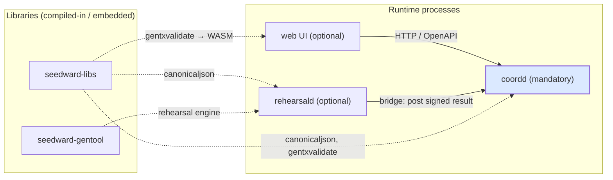

# Architecture overview

The suite is a small set of layered repos around **one coordination server**. Only `coordd` must run;
the rest are optional processes, libraries, or build-time tools. For the end-to-end sequence across
components, see [Launch flow](launch-flow.md).

## Runtime topology

<small>Solid = a live network call. Dashed = a compile-time / embedded dependency (no running process).</small>

## Components

Maturity is the durable signal (tags move); the same table with published tags lives on the
[home page](../index.md#component-status).

| Repo                        | Role                                         | Status                         | Must run?                                                                   |
|-----------------------------|----------------------------------------------|--------------------------------|-----------------------------------------------------------------------------|
| **seedward-chaincoord**     | the coordination server (`coordd`)           | Release candidate — v1 imminent | **Yes** — the only mandatory process                                        |
| **seedward-chaincoord-web** | Next.js UI; calls coordd's HTTP API          | 🚧 Heavy development — PoC, not for production | Optional (browser UI)                                                       |
| **seedward-rehearsal**      | `rehearsald` daemon + `rehearse` CLI         | 🚧 Heavy development — expect breaking changes | Optional bolt-on (auto pre-flight rehearsal)                                |
| **seedward-libs**           | shared Go lib (canonicaljson, gentxvalidate) | Stable                         | No — **compiled into** coordd/rehearsal/cli                                 |
| **seedward-gentool**        | genesis engine + build CLI                   | Pre-1.0 — API still settling   | No — **embedded** by rehearsal; a build/dev tool                            |
| **seedward-cli**            | unified `seedward` CLI                       | Not shipping for v1 — stubs    | No — **post-v1, not shipping for v1** (coordd/rehearsal commands are stubs) |

## Runtime vs build-time

- **Processes you run:** `coordd` always; add `rehearsald` for automated rehearsals and the web UI for
  the browser front-end. That is the entire runtime surface.
- **Compiled-in / build-time:** `seedward-libs` (linked into coordd, rehearsal, cli), `seedward-gentool`
  (the genesis/rehearsal engine embedded by rehearsal; also a standalone build CLI), and
  `seedward-chaincoord-web` (built to static assets, then served).

## Responsibilities & non-goals

Each component does one job and deliberately stays out of the others:

- **coordd** owns the launch record, the state machine, governance, gentx/allocation intake, and the audit
  log. It **never** boots a node, holds a user key, assembles genesis, or triggers a rehearsal.
- **rehearsald** pre-flights an assembled genesis and returns a signed fact. It **never** produces the
  publishable genesis artifact — that's the committee's, built with gentool.
- **gentool** builds genesis (embedded by rehearsal; run standalone for the final artifact). It talks to no
  server.
- **the web** is the **exclusive home of human signing** (ADR-036 via the wallet) plus the coordinator /
  committee / validator UI. It holds no server-side secrets. It also embeds `gentxvalidate` (from
  seedward-libs) compiled to **WASM** for instant client-side gentx checks in the browser — the same
  validator coordd runs server-side, so the UI can flag a bad gentx before it is ever submitted.
- **seedward-libs / gentool** are compiled in — no process, no network.

## Governance plane vs ops plane

Two credential planes stay separate:

- **Governance plane** — committee members, coordinators, and validators authenticate + authorize by **wallet signing** in the web
  (ADR-036, [ADR-0011](../decisions/0011-adr036-challenge-response-auth.md)). No server-held keys.
- **Ops plane** — the coordd↔rehearsal bridge uses a **deploy-time ops credential**
  ([ADR-0007](../decisions/0007-bridge-fact-based-trust-boundary.md)), network-isolated behind the
  `/bridge/*` prefix — never a user wallet.

## The coordd ↔ rehearsal bridge

coordd never calls the rehearsal service. The bridge is a **one-way write-back**: `rehearsald` claims a
launch's run, pulls the approved input set from coordd, boots an ephemeral chain, and posts a
**signature-verified result fact** back. coordd's optional rehearsal *gate* then consults that fact when
finalizing genesis. See [ADR-0007](../decisions/0007-bridge-fact-based-trust-boundary.md) +
[ADR-0003](../decisions/0003-rehearsal-optional-bolt-on.md), and the full wire contract in
[Bridge contract](../reference/bridge-contract.md).