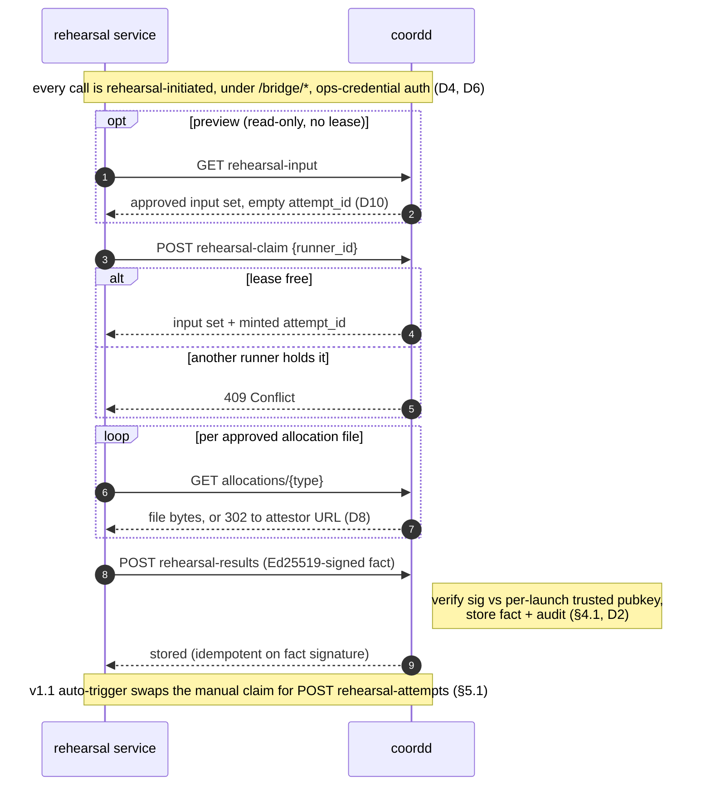

# Bridge contract — coordd ↔ rehearsal (v1)

_The normative v1 wire contract between coordd and the rehearsal service. Field-level JSON is normative;
transport detail is illustrative — EXCEPT the `/bridge/*` prefix, which is load-bearing for network
isolation (D6). The architectural decisions behind it are recorded as ADRs — the fact-based trust
boundary ([ADR-0007](../decisions/0007-bridge-fact-based-trust-boundary.md)) and result write-back /
claim-lease ([ADR-0008](../decisions/0008-rehearsal-write-back-and-lease.md)); the decision log D1–D10 is
in §6._

## 0. Principles this encodes

These four principles are the architecture, recorded as
[ADR-0007](../decisions/0007-bridge-fact-based-trust-boundary.md):

- **coordd never initiates.** Both directions are *initiated by the rehearsal service*: it pulls inputs,
  it pushes the result fact. coordd serves, authorizes, and accepts — it never calls out.
- **Ops plane, not committee identity.** Bridge calls authenticate with an infrastructure credential
  (token/mTLS). The rehearsal service is a headless daemon with no wallet; no wallet signing exists
  anywhere on this path.
- **Trust is in the fact, not the trigger.** The result fact is Ed25519-signed by the rehearsal service's
  own service key, mirroring the audit-log scheme exactly.
- **Coordinate over facts.** coordd stores results and attempts as facts; the gate and the anti-runaway
  cap are rules over those facts, never executions coordd performs.

## 1. Shape: rehearsal-initiated calls



- **Read (preview)** — `GET /bridge/launches/{id}/rehearsal-input` → the approved build input (metadata +
  per-file URLs), read-only, no lease, empty `attempt_id` (D10).
- **Claim (run entry)** — `POST /bridge/launches/{id}/rehearsal-claim {runner_id}` → acquires the single-writer
  run lease and returns the build input with a minted `attempt_id`; 409 if another runner holds the lease (D10).
- **Fetch allocation** — `GET /bridge/launches/{id}/allocations/{type}` → streams one approved allocation
  file (host bytes) or 302-redirects to its attestor URL (D8).
- **Write-back** — `POST /bridge/launches/{id}/rehearsal-results` → the signed result fact.
- **Claim** — `POST /bridge/launches/{id}/rehearsal-attempts` → exists only for v1.1
  auto-triggers (§5.1). Not used by the v1 manual flow.

All bridge endpoints sit under the `/bridge/*` prefix so they can be network-restricted to an
internal VNet with one rule (D6). Auth: all require an ops credential (D4). The write-back
additionally requires a valid service signature from a pubkey coordd trusts for this launch (§4.1, D2).

---

## 2. Read payload — the rehearsal input

coordd assembles this from authoritative state. **Only `APPROVED` join requests**
(`joinrequest.StatusApproved`) appear in `gentxs`; **only committee-approved allocation
files** appear in `allocations`.

**coordd serves the approved set as-is (D7).** It applies **no** min-gentx / "enough to run" /
runnability gate and **no** status gate — its only guards on `GET rehearsal-input` are ops-cred
(401) and launch-exists (404). Judging whether the set assembles and boots is the rehearsal's whole
job: an insufficient set yields a `FAIL` (`failed_step: "build"|"boot"`), bound to `input_set_hash` —
that is the honest answer, not something for coordd to pre-empt. Skipping obviously-moot runs
(terminal states, etc.) is the **rehearsal service's** operator-config decision, not coordd's (D7).

> **No baseline genesis (D1).** coordd receives the *already-built* final genesis for
> committee validation and never builds genesis itself, so it has no baseline to serve.
> The rehearsal service generates its own baseline with `<chaind> init` (it has the
> binary) and `genesis.Build` applies everything on top. Params not carried in the chain
> record fall back to the binary's `init` defaults — acceptable for rehearsal, whose job
> is "does this gentx+allocation set boot and reconcile," not validating exact param
> values. The authoritative final genesis remains the committee-built one the committee
> validates.

```jsonc
{
  "schema_version": 1,
  "launch_id": "<uuid>",
  "attempt_id": "<uuid>",              // coordd-minted anchor for this input set (D9); echo in the result
  "generated_at": "<RFC3339>",
  "status":      "DRAFT|PUBLISHED|WINDOW_OPEN|WINDOW_CLOSED|GENESIS_READY|LAUNCHED|CANCELED",
                                     // the launch's current lifecycle status. Carried so the
                                     // rehearsal service can apply its own status-filter config
                                     // (D7) and skip without a boot. NOT part of input_set_hash (§3).

  "chain": {                         // from launch.ChainRecord
    "chain_id":                   "string",
    "bech32_prefix":              "string",
    "denom":                      "string",
    "total_supply":               "string",   // bigint string, base denom — supply anchor (D5)
    "min_self_delegation":        "string",   // bigint string, base denom
    "max_commission_rate":        "string",   // "" = unset
    "max_commission_change_rate": "string",
    "min_validator_count":        0,
    "genesis_time":               "<RFC3339|null>",
    "binary": {
      "name":    "string",
      "version": "string",
      "sha256":  "string",
      "repo_url":    "string",
      "repo_commit": "string"
    }
  },

  "gentxs": [                        // APPROVED join requests, sorted by operator_address
    {
      "operator_address": "string",
      "consensus_pubkey": "string",  // base64 ed25519 (already extracted by coordd)
      "moniker":          "string",
      "self_delegation":  "string",  // bigint string, base denom
      "gentx":            { }        // joinrequest.GentxJSON, verbatim
    }
  ],

  // Every allocation type is a committee-approved FILE, accounts included (§6, D3).
  // An absent key = that file was never provided/approved (graceful skip).
  "allocations": {
    "accounts": { "sha256": "string", "approved_by_proposal": "<uuid>", "url": "string" },
    "claims":   { "sha256": "string", "approved_by_proposal": "<uuid>", "url": "string" },
    "grants":   { "sha256": "string", "approved_by_proposal": "<uuid>", "url": "string" },
    "authz":    { "sha256": "string", "approved_by_proposal": "<uuid>", "url": "string" },
    "feegrant": { "sha256": "string", "approved_by_proposal": "<uuid>", "url": "string" }
  },

  "input_set_hash": "string"         // sha256-hex; see §3
}
```

**Maps onto `genesis.Build(ctx, baseGenesis, cfg, repos)`:**
- `baseGenesis` ← rehearsal service runs `<chaind> init` (not from coordd — D1).
- `cfg.AddressPrefix` ← `chain.bech32_prefix`; `cfg.BondDenom` ← `chain.denom`;
  `cfg.TotalSupply` ← `chain.total_supply` (the supply anchor — **required**; `genesis.Build`
  fails without it). Remaining `ChainConfig` fields ← chain record + `init` defaults
  (rehearsal-service concern). **v1 limitation:** vesting windows, `non_staked_amount`,
  `community_pool_amount`, and denom/staking/slashing/gov/mint params are not yet carried, so the
  bridged flow fully supports the **gentxs + accounts** surface; launches with claims/grants or a
  community pool, and exact param assertions, need those fields added in a later amendment.
- `repos.Validators` ← `gentxs[].gentx`
- `repos.InitialAccounts` ← `allocations.accounts` (file)
- `repos.Claims / Grants / AuthzGrants / FeeAllowances` ← `allocations.{claims,grants,authz,feegrant}`
  (nil/skip when the key is absent).

**Graceful degradation:** until per-file allocation storage + approval ships (§6, D3), `allocations` is
empty and rehearsal runs on gentxs alone; the contract does not change when files arrive.

**Allocation content is streamed by reference, not inlined (D8, 2026-07-04).** Each allocation
entry carries a **`url`**, not the bytes. The daemon streams each file from that URL — coordd's
ops-gated per-file endpoint `GET /bridge/launches/{id}/allocations/{type}`, which **streams host
bytes (`io.Copy`, constant memory)** or **302-redirects to the external URL for attestor-mode
files**. This replaced an earlier inline-`content_b64` design (D7), which buffered every file into
one JSON on coordd (raw + 33% base64 + marshal buffer, all resident) — a ~250 MB–1 GB memory spike
for airdrop-scale `accounts.csv` (100k–1M+ rows). Streaming by reference keeps coordd's memory
**constant** regardless of file size, removes base64 inflation, and makes **attestor mode just
work** (the daemon follows the redirect) — so the earlier 422 refuse is gone. `url` is a coordd-
relative path; the daemon resolves it against its coordd base URL. The op token is dropped by the
HTTP client on the cross-host redirect to the attestor, which is correct (the attestor isn't coordd).

---

**Wire conformance (drift guard, 2026-07-04).** The payload structs are **duplicated**, not shared
— coordd (`api/bridge.go`) and the daemon (`internal/bridge/input.go`) each own their view, so client
and server evolve independently (the `status`-emitted-but-ignored case above depends on exactly this).
To stop the two copies silently drifting, each side has a test pinned to a **canonical golden payload**
that mirrors this section: coordd **marshals** to it (`TestRehearsalInputJSON_WireGolden`), the daemon
**decodes** it (`TestRehearsalInput_DecodesWireGolden`). A rename/drop on either side fails that side's
test loudly. The two golden copies must be kept in sync with each other and with this §2. (A single
shared fixture in `seedward-libs` was considered and deferred — it would couple the two via a lib
release; revisit if the manual sync proves error-prone.)

## 3. `input_set_hash` — the staleness key (normative)

The single value binding a result to the exact inputs it ran against. Computed by coordd
over the **canonical JSON** (`pkg/canonicaljson.MarshalForSigning`) of this ordered
structure, then SHA-256, hex-encoded:

```jsonc
{
  "chain": { …all chain fields above… },
  "gentxs": [                         // sorted by operator_address, ascending
    { "operator_address": "string", "consensus_pubkey": "string", "gentx_sha256": "string" }
  ],
  "files": {                          // null when the file is absent
    "accounts_sha256": "string|null",
    "claims_sha256":   "string|null",
    "grants_sha256":   "string|null",
    "authz_sha256":    "string|null",
    "feegrant_sha256": "string|null"
  }
}
```

Properties: deterministic (canonicaljson removes key-order/whitespace variance) and
covers everything that changes the built genesis — the gentx set, every approved file,
and the binary identity. Changing any of them changes the hash, which is exactly what
makes a prior result detectably stale. (The baseline is excluded because it is a
deterministic function of the chain record + binary, both already covered.)

**`status` and `generated_at` are excluded from the hash (D7).** They are payload metadata, not
genesis inputs. Crucially, excluding `status` means a `PASS` produced in `WINDOW_OPEN` stays *current*
after the launch advances to `WINDOW_CLOSED` as long as the inputs are unchanged — the result tracks
the input set, not the lifecycle. Including status would spuriously invalidate a still-valid result on
every transition.

---

## 4. Write-back payload — the result fact

`POST /bridge/launches/{id}/rehearsal-results`, body:

```jsonc
{
  "schema_version": 1,
  "launch_id":      "<uuid>",
  "input_set_hash": "string",        // the set THIS run consumed (from §2)
  "attempt_id":     "<uuid>",        // REQUIRED (D9): the attempt coordd minted on rehearsal-input, echoed back

  "outcome":     "PASS | FAIL | ERROR | SKIPPED",   // SKIPPED = status-filtered, nothing ran (D7)
  "failed_step": "string|null",      // e.g. "build", "boot", "assert:supply_reconciles"; null on SKIPPED
  "summary":     "string",           // one-line human verdict
  "steps": [
    { "name": "build",  "status": "PASS|FAIL|SKIP", "detail": "string" },
    { "name": "boot",   "status": "PASS|FAIL|SKIP", "detail": "string" },
    { "name": "assert:<id>", "status": "PASS|FAIL|SKIP", "detail": "string" }
  ],

  "rehearsal": {
    "engine_version":  "string",
    "binary_name":     "string",
    "binary_version":  "string",
    "binary_sha256":   "string",     // what actually ran; coordd may compare to chain.binary
    "validators":      2,
    "blocks_advanced": 0
  },

  "started_at":  "<RFC3339>",
  "finished_at": "<RFC3339>",

  "service_pubkey": "string",        // base64 ed25519
  "signature":      "string"         // base64 ed25519, see §4.1
}
```

> **`blocks_advanced` is currently always `0`.** The engine gates a `PASS` on the chain reaching height
> ≥ 1 (so a `PASS` *did* advance at least one block), but it does not yet surface the height reached —
> the field is left `0` pending a gentool engine addition. No consumer should key on it; the
> authoritative signal is `outcome`.
>
> **`engine_version`** is the rehearsal service's build version, which pins (via its `go.mod`) the exact
> gentool engine it embeds — so it transitively identifies the engine.

**Outcome semantics (distinct on purpose):**
- `PASS` — built, booted, all assertions passed. The only thing the v1.1 gate accepts.
- `FAIL` — a real negative verdict: build/boot/assertion failed. The genesis is bad.
- `ERROR` — infrastructure failure (no container runtime, binary fetch failed, timeout).
  *Not* a verdict on the genesis; the gate treats it as "no usable result." Counts
  against the attempt cap (§5.1) so infra failures can't loop forever.
- `SKIPPED` (D7) — the rehearsal service's status-filter excluded this launch's `status`, so **nothing
  ran** (no boot, no load). *Not* a genesis verdict — deliberately **not** `FAIL`, which would wrongly
  imply the genesis is bad. `failed_step` is null. Whether the service posts a `SKIPPED` fact at all is
  its choice (for an audit trail); if posted it is informational only, never accepted by the v1.1 gate.
  The service also returns `"skipped: status <X> excluded"` to the triggering console/CLI.

**What a result certifies (and what it does not).** The boot runs on a **substituted
validator set** — the real gentxs' consensus *private* keys are not available, so a
genesis built from them cannot produce blocks. The rehearsal swaps in throwaway
validators (real allocations/params/supply, fake consensus keys); `rehearsal.validators`
is the count of those test validators, not the real set. A `PASS` therefore means *the
input set assembles (build on the real inputs) and a representative chain initializes and
advances (boot on substitutes)* — it is a **pre-flight on the input set, not a
certification that the real network will produce blocks**, and the service produces **no
publishable genesis** (the booted copy is doctored; the authoritative final genesis is
built locally by a committee member — D1). coordd must not present a `PASS` as "the genesis
is certified to run."

### 4.1 Signature (mirrors `auditlog.Append`, exactly)
1. Serialize the fact with `signature` set to `""` via `canonicaljson.MarshalForSigning`.
2. `ed25519.Sign(servicePrivKey, msg)`, base64-encode into `signature`.
3. coordd verifies: recompute canonical bytes with `signature=""`, `ed25519.Verify`
   against `service_pubkey`, **and** confirm `service_pubkey` is the launch's trusted
   rehearsal-service key (D2: recorded on the launch record next to the advertised
   rehearsal endpoint, set via an ops/committee action).

Same scheme coordd already uses for its audit log: canonical JSON + Ed25519 + base64. No second crypto
design.

---

## 5. What coordd does on receipt
1. Verify ops credential + signature + trusted pubkey (§4.1). Reject otherwise.
2. Store the fact as the launch's latest rehearsal result (keyed by `input_set_hash`).
3. Append an audit event (`RehearsalResultRecorded`) carrying outcome + input_set_hash,
   so the fact is itself in the tamper-evident log.
4. If `attempt_id` is set, close that attempt (§5.1).
5. Expose the latest result for reads (status view, v1.1 gate).

**The gate.** coordd's optional `WINDOW_CLOSED → GENESIS_READY` gate (`COORD_REHEARSAL_GATE`, default
`off`) consults the latest stored fact: in `required` mode the transition passes only if that fact is
`PASS` **and current** — its `input_set_hash` equals coordd's freshly recomputed hash for the present
approved set (a `PASS` whose hash no longer matches is **stale** and does not satisfy the gate).
`advisory` records but never blocks; `off` never consults a fact (a standalone coordd is untouched).
Enforced at proposal *raise* with a required-only re-check at *execute*; startup fails fast if `required`
but no ops token. See [ADR-0003](../decisions/0003-rehearsal-optional-bolt-on.md). The attempt **cap**
(§5.1) stays v1.1b.

### 5.1 Anti-runaway: claim-before-run (D10) + attempt cap (v1.1b)

Claim-before-run is the v1 mechanism (the leased `POST rehearsal-claim`, D10 — see
[ADR-0008](../decisions/0008-rehearsal-write-back-and-lease.md)): single-flight (a second runner gets
409) plus a deterministic self-heal for a stuck runner via the lease TTL + non-extending re-claim. What
remains for **v1.1b is the attempt CAP** below: a bound on *fresh acquisitions per
`(launch, input_set_hash)`* so a runner that loops `claim → run → result → re-claim` (or a v1.1
auto-trigger that re-fires on every failed write-back) is eventually **hard-stopped**, not merely
rate-limited by the TTL. v1's manual, single-service trigger keeps this low-urgency; it becomes essential
with v1.1 auto-triggers + multiple runners.

**v1 has no *initiation* runaway exposure** — activation is *manual* (`seedward rehearse`, ops cred):
a human triggers exactly one run, coordd is uninvolved in activation. The auto-trigger loop risk
exists only for v1.1 (on-transition / debounced), where a failed write-back
could otherwise re-trigger forever and burn a chain boot each time. The cap makes coordd
the gatekeeper of *permission to run* (authorizing ≠ initiating, so the "coordd never initiates"
principle in §0 holds):

1. Before booting, the rehearsal service **claims an attempt**:
   `POST /bridge/launches/{id}/rehearsal-attempts { "input_set_hash": "…" }`.
   - coordd returns `{ "attempt_id": "<uuid>" }`, **or** `409` if an attempt for that
     hash is already in-flight (single-flight), **or** `429` if the attempt count for
     that hash has hit the cap.
2. The service runs and posts the result (§4) referencing `attempt_id`.
3. If no result arrives within a deadline, coordd **times the attempt out** and counts it
     as a failed attempt against the cap.
4. Once the cap is reached for a hash, coordd **stops advertising the work and raises an
     alert** ("rehearsal repeatedly failing for set H") — nothing re-runs until a human
     intervenes (e.g. resets, or the approved set changes → new hash → fresh budget).

This makes self-looping impossible: the service cannot run without a claim, and coordd
caps claims per hash. Attempts are facts; the cap is a rule over them.

---

## 6. Decisions — resolved 2026-06-16
- **D1 — baseline genesis: not served.** coordd holds only the *built final* genesis (for
  committee validation) and never builds genesis, so there is no baseline to give. The
  rehearsal service generates its own via `<chaind> init`. Dropped from the payload and
  from `input_set_hash`. (§2 note.)
- **D2 — trusted service pubkey: on the launch record**, alongside the advertised
  rehearsal endpoint, set by an ops/committee action. coordd verifies result-fact
  signatures against it. (§4.1.)
- **D3 — allocations are per-file for *all* types, accounts included.** chaincoord's
  existing per-entry `GenesisAccount` proposal machinery is superseded by file-level
  approval (per-entry doesn't scale to human review → rubber-stamping). Committee approval
  = authorization/provenance; correctness is mechanical (gentool build + rehearsal). (§2.)
- **D4 — read-endpoint auth: ops credential**, same as the write-back. The rehearsal
  service is headless with no wallet (the ops plane bars wallet identity, §0), so a
  committee session is not an option; one ops-credential type covers the whole bridge.
  The payload is launch-internal but not secret, so ops-cred gating suffices.

- **D5 — `total_supply` carried in the chain record (amended 2026-06-26).** The engine's
  `genesis.Build` requires a supply anchor and fails without it; deriving it in the rehearsal
  service would duplicate gentool's supply accounting and miss `community_pool_amount` (absent from
  the payload). So coordd serves `total_supply` in `chain` (§2) and it is covered by `input_set_hash`
  (§3, "all chain fields"). Other supply/vesting/param fields remain a known v1 limitation (§2 note)
  — added later if bridged claims/grants or exact param assertions are needed.

- **D6 — bridge endpoints under a dedicated `/bridge/*` prefix; ops auth = one shared file-based
  bearer token (decided 2026-07-03).** All daemon-facing bridge endpoints live under `/bridge/…`
  (`GET /bridge/launches/{id}/rehearsal-input`, `POST /bridge/launches/{id}/rehearsal-results`, and the
  v1.1 `POST /bridge/launches/{id}/rehearsal-attempts`), grouped so a devop restricts `/bridge/*` to an
  internal network with a single L7 rule (internet-cut) — this *is* how it should be deployed. coordd
  authenticates the ops plane with **one deployment-wide bearer token**, read from a file
  (`rehearsal_ops_token`, mirroring the audit/jwt key files), constant-time compared. This is **not** a
  token-management system: rotation is "swap the secret + reload," owned by the deployment's secret
  store; per-launch/per-service tokens or mTLS are v1.x. The coarse shared token is acceptable because
  the trust-critical *write* is gated per-launch by the D2 service pubkey, not the token. The
  committee-facing result read-back stays on the governance plane (`GET /launch/{id}/rehearsal`), **not**
  under `/bridge`.
- **D7 — coordd serves rehearsal-input as-is; status-filtering is the rehearsal service's config; new
  `SKIPPED` outcome (decided 2026-07-03).** coordd applies **no** runnability / min-gentx / status gate
  on `GET rehearsal-input` (only ops-cred + launch-exists); an insufficient set is answered by the
  rehearsal's own `FAIL`, never pre-empted by coordd (coordinate over facts, §0). *Which* statuses are
  worth running is **operator config on the rehearsal service** (e.g. default-skip `CANCELED` / `LAUNCHED`):
  it rejects an excluded launch cleanly with **no boot** → outcome `SKIPPED` (§4) plus a
  `"skipped: status <X> excluded"` console/CLI line; it does **not** post a misleading `FAIL`. To enable
  this, coordd carries the launch `status` in the input payload (§2) but **excludes it from
  `input_set_hash`** (§3) — so a `PASS` stays current across lifecycle transitions while the inputs are
  unchanged.

- **D8 — allocation content is streamed by reference, superseding inline `content_b64` (decided
  2026-07-04).** The rehearsal-input `allocations[type]` carries `{sha256, approved_by_proposal, url}` —
  **no bytes**. The daemon streams each file from `url` = coordd's ops-gated `GET
  /bridge/launches/{id}/allocations/{type}`, which `io.Copy`s host bytes (constant memory) or 302s to the
  attestor URL. Rationale: the earlier inline design (D7) buffered every allocation into one JSON on coordd
  (raw + 33% base64 + marshal buffer) → ~250 MB–1 GB spikes for airdrop-scale files (100k–1M+ accounts),
  making it unusable on a real (airdrop) launch. By-reference keeps coordd memory **constant**, drops base64
  inflation, and makes **attestor mode work** (follow the redirect) — so the D7-era attestor-422 refuse is
  removed. `input_set_hash` is **unchanged** (§3 already hashes each file's `sha256`, never its content).
  The daemon still buffers one file at a time (it needs the bytes to build genesis), but the daemon is the
  compute-heavy side, provisioned for it — unlike the lightweight coordination server.

- **D9 — result write-back is anchored to a coordd-minted attempt; stale results are stored, not
  fabricated (decided 2026-07-04, B3).** `GET rehearsal-input` get-or-creates an **attempt**
  `{id, launch, input_set_hash, issued_at}` keyed by `(launch, input_set_hash)` and returns `attempt_id`.
  The result fact echoes it. `POST /bridge/launches/{id}/rehearsal-results` accepts a fact only if: (1)
  its Ed25519 signature verifies against the launch's **trusted** `rehearsal_service_pubkey` (D2, not the
  self-declared `service_pubkey`); (2) it references an attempt coordd minted for **this** launch whose
  `input_set_hash` matches — else **rejected (400) as fabricated**, so coordd never stores a hash it did
  not itself serve; (3) the outcome is a known verdict (PASS/FAIL/ERROR/SKIPPED). The result is stored
  and flagged **`stale`** when the attempt's input set is no longer the launch's current one (genuine
  result, drifted inputs). Write-back is **idempotent** on the fact signature. **Boundary:** the attempt
  binding vouches the *input set was genuine*, NOT that the *PASS/FAIL verdict is honest* — verdict trust
  stays with the signature (D2). The attempt lifecycle carries inert lease columns
  (`status/claimed_at/lease_expires_at/runner_id`) reserved for the **B3.5** claim-before-run lease (§5.1),
  which the manual v1 flow does not yet enforce. The fact wire shape is pinned by a result-fact drift
  golden on both sides (mirror of §2's). Committee members read stored results back on the **governance**
  plane (not `/bridge`): `GET /launch/{id}/rehearsal` returns each result's outcome, failed step,
  input-set hash, and `stale` flag, newest first (B4).

- **D10 — claim-before-run lease enforced in v1 (decided 2026-07-04, B3.5), reversing the earlier
  "v1 manual = no claim" stance (§5.1).** The run entry point is `POST rehearsal-claim {runner_id}`, which
  mints the attempt AND acquires a single-writer lease on `(launch, input_set_hash)`, returning the build
  input. A second runner claiming the same input set while the lease is live gets **409** with
  `{claimed_by, claimed_at, lease_expires_at}`; the **same** runner re-claiming is an idempotent no-op that
  **does not extend** the lease deadline — so a chatty or crash-looping runner cannot hold the lease past its
  original window and starve others. The lease **auto-expires** after a TTL (default 45 min — longer than a
  bounded rehearsal, so a crashed runner self-heals), evaluated lazily on the next claim (no sweeper). A committee member can force-release a
  stuck lease immediately via `POST /launch/{id}/rehearsal/{attempt_id}/reset` (governance plane, not
  `/bridge`). **Reset authz:** any single member of the launch **committee** (`l.Committee.HasMember`),
  immediate — no M-of-N proposal (low-stakes operational recovery; worst case is a redundant read-only
  rehearsal, so it uses the same single-member gate as member management, not the heavy proposal path).
  Recording a result releases the lease (RUNNING → DONE). Consequently `GET rehearsal-input` is
  **demoted to a read-only preview** (no mint, no lease, empty `attempt_id`): a runner MUST claim to obtain a
  usable `attempt_id`, which is what makes the D9 anti-fabrication check enforce "claimed before recorded."

## 7. Out of scope for this contract
Forked-state job inputs (v2), caller-supplied checks (open mode, v2.y), trigger-policy
internals beyond the claim/cap mechanism (v1.1), and the rehearsal service's own
binary-acquisition/sandbox mechanics (service-internal; the bridge supplies only the
binary *reference* + sha256 for integrity).
